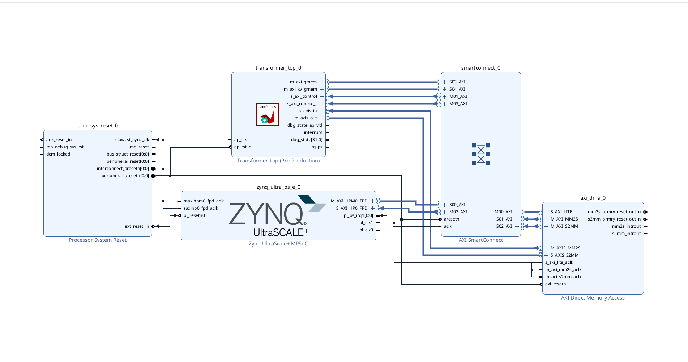

# ELEC 498 Capstone — LiteLM

## Project Overview

**LiteLM** is an FPGA-based hardware accelerator designed to run inference for Transformer-based Large Language Models (LLMs) on edge devices. The project offloads compute-intensive matrix multiplication and attention operations to the FPGA programmable logic (PL), while precision-sensitive operations (layer norm, softmax, requantization) are handled by the ARM processor (PS) in firmware. This split was a key architectural decision — earlier all-hardware approaches suffered severe data loss from performing requantization entirely in fixed-point logic.

**Target board:** Kria KV260 Vision AI Starter Kit
**Part number (Vitis/Vivado):** `xck26-sfvc784-2lv`
*(In Vivado you can also select the KV260 board directly from the board selection menu.)*

**KV260 Linux boot reference:** [xilinx.github.io/kria-apps-docs/kv260/linux_boot.html](https://xilinx.github.io/kria-apps-docs/kv260/linux_boot.html)

---

## Vivado Block Design

The image below is the block design from the Vivado software, showing the full PL architecture: HLS accelerator IP, AXI interconnects, DMA controllers, and PS connections.



---

## Repository Layout

```
ELEC_498-Capstone-LiteLM/
├── Model-architectures/
│   ├── gpt2-MatMulMode/       — Active design: GPT-2 INT8 MatMul-mode accelerator
│   └── legacy-architecture/   — Abandoned prior architectures (see note below)
├── hardware_overlay/          — FPGA bitstream, device trees, and IP drivers
├── firmware/                  — ARM PS-side inference engine (Linux, C++)
├── Helper_Scripts/            — Utility scripts for quantization, overlay generation, and tooling
├── fpga_Kria_260_Board_specs.md  — KV260 board reference notes
├── TCL_commands.md            — Useful Vivado/Vitis TCL command reference
└── Vitis_and_Vivado_Commands.md  — HLS/synthesis workflow command reference
```

---

## `./Model-architectures/gpt2-MatMulMode/` — Active Design

The current working accelerator targeting GPT-2 small (124M parameters) with INT8 per-tensor quantization. See [`Model-architectures/gpt2-MatMulMode/README.md`](Model-architectures/gpt2-MatMulMode/README.md) for full detail on every file and subdirectory.

| Subdirectory | Purpose |
|--------------|---------|
| `HLS-Verilog/` | HLS C++ hardware modules: Scheduler FSM, Compute Controller, MMU, Control Memory Interface, test data and generated RTL |
| `logs/` | Captured C-simulation and synthesis run logs |
| `model/` | Quantized GPT-2 weights, embeddings, DDR memory map, and tokenizer data |

**Firmware** for this design lives at [`/firmware/`](firmware/) — see below.

### Vivado Address Map

Address segments from the Vivado block design (`design_1`). Only active (non-excluded) assignments are shown. Source: [`vivado_simulations/edge_gpt/AddressSegments.csv`](vivado_simulations/edge_gpt/AddressSegments.csv).

**PS (`zynq_ultra_ps_e_0/Data`) → PL peripherals** — AXI-Lite control register windows the ARM uses to start/stop the DMA and accelerator:

| Slave Interface | Base Address | Range | Description |
|----------------|-------------|-------|-------------|
| `axi_dma_0/S_AXI_LITE/Reg` | `0xA0000000` | 64K | DMA controller control registers |
| `transformer_top_0/s_axi_control/Reg` | `0xA0010000` | 64K | HLS accelerator control/status registers |
| `transformer_top_0/s_axi_control_r/Reg` | `0xA0020000` | 64K | HLS accelerator secondary control registers |

**DMA (`axi_dma_0`) → DDR** — both channels mapped to the lower 2 GB DDR:

| Channel | Base Address | Range | Description |
|---------|-------------|-------|-------------|
| `Data_MM2S` | `0x00000000` | 2G | Reads token embeddings from DDR → streams to accelerator |
| `Data_S2MM` | `0x00000000` | 2G | Writes accelerator output token back to DDR |

**Accelerator (`transformer_top_0`) → DDR** — two AXI master ports for direct DDR access:

| Master Port | Base Address | Range | Description |
|-------------|-------------|-------|-------------|
| `Data_m_axi_gmem` | `0x800000000` | 2G | Main weight/activation access (upper DDR bank) |
| `Data_m_axi_kv_gmem` | `0x00000000` | 2G | KV cache access (lower DDR bank) |

---

## `./Model-architectures/legacy-architecture/` — Abandoned Architectures

These directories contain earlier hardware designs that were **not viable on the board**.

> **Why they did not work:** The architectures themselves were functionally correct in simulation, but the requantization method used to rescale activations between layers caused an enormous amount of precision loss when implemented entirely in fixed-point hardware. Layer norm, softmax, and requantization are numerically sensitive operations — running them in the PL with INT8/INT16 arithmetic accumulated errors that made model outputs unusable. The solution adopted in the active design was to move these operations to the firmware (ARM PS), keeping only the bulk matrix multiplications in the PL.

| Directory | Description |
|-----------|-------------|
| `legacy-architecture/gpt2-endTOend-HARDWARE/` | End-to-end GPT-2 attempt including full firmware stack and hardware overlay. See its [`README.md`](Model-architectures/legacy-architecture/gpt2-endTOend-HARDWARE/README.md). |
| `legacy-architecture/phi3-mini-int4-HARDWARE/` | Phi-3 Mini INT4 attempt with RoPE support and extended requant calibration. See its [`README.md`](Model-architectures/legacy-architecture/phi3-mini-int4-HARDWARE/README.md). |

---

## `./hardware_overlay/`

FPGA bitstream, device trees, and Xilinx IP drivers needed to load the accelerator onto the KV260.

| Path | Purpose |
|------|---------|
| `design_1_wrapper.bit` | Compiled FPGA bitstream (full PL design) |
| `design_1_wrapper.xsa` | Vivado hardware export used to generate device trees and drivers |
| `bitstream.bif` | Bootgen bitstream information file |
| `psu_init.*` | Zynq UltraScale+ PS initialization scripts and headers |
| `generate_dts.tcl` | TCL script to regenerate the device tree from the XSA |
| `dts_output/` | Generated device tree files: `system-top.dts`, `pl.dtsi`, `pcw.dtsi`, `zynqmp.dtsi` |
| `device-tree-xlnx/` | Xilinx device tree binding library (full repo, 80+ IP blocks) |
| `drivers/transformer_top_v1_0/` | Custom Xilinx IP driver for the transformer top-level module (C + Linux variant) |
| `drivers/axi_top_v1_0/` | AXI top-level hardware register header |
| `output/` | Runtime hardware loading scripts |

---

## `./firmware/`

ARM Cortex-A (PS-side) Linux software that controls the accelerator: loads weights into DDR, streams token embeddings to the PL via DMA, reads back the output token, and handles all precision-sensitive operations (layer norm, softmax, requantization) in software.

| Path | Purpose |
|------|---------|
| `inference_engine/include/` | Headers: DMA buffer management, PL interface, tokenizer, performance monitor, error handler, type definitions |
| `inference_engine/src/inference_engine.cpp` | Main inference loop |
| `inference_engine/src/pl_interface.cpp` | Low-level AXI register and DMA interface to the PL |
| `linux_boot_files/boot.cmd` | U-Boot boot script |
| `linux_boot_files/system.dts` | System device tree source |
| `udmabuf/` | Third-party Linux kernel module for user-space DMA buffer allocation |
| `dependencies/` | Pre-built AArch64 cross-compilation toolchain and Linux sysroot |
| `Makefile` | Builds the inference engine binary for ARM64 |
| `install_dependencies.sh` | Installs build dependencies |

---

## `./Helper_Scripts/`

Utility scripts for quantization, DDR overlay generation, and Vitis/Vivado tooling.

| File | Purpose |
|------|---------|
| `quantize_gpt2.py` | Quantizes GPT-2 weights to INT8 and exports calibrated scale factors |
| `gen_requant_scales.py` | Generates requantization scale headers (`requant_scales_vN.hpp`) from calibration data |
| `overlay_generator.sh` | Generates the hardware overlay (device tree + bitstream bundle) for the KV260 |
| `fix_readmemh_dat_paths.py` | Fixes absolute `$readmemh` paths in HLS-generated Verilog to use relative paths |
| `relativize_readmem_dat_paths.py` | Variant of the above for relocatable simulation setups |
| `modify_xml.sh` | Patches Vivado IP XML descriptors (e.g., after HLS re-export) |
| `Vitis_Run_All_Commands.sh` | Batch script to run the full Vitis HLS build flow |
